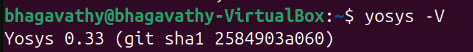

# SFAL VSD Tools Installation and Setup

## Project Overview
This repository documents the installation and setup of essential tools for the SFAL VSD (Very Small Design) course. It includes step-by-step instructions, snapshots of successful installations, and verification commands for all tools.

---

## System Requirements
- RAM: 6 GB  
- HDD: 50 GB  
- CPU: 4 vCPU  
- OS: Ubuntu 20.04+  

---

## Tools Installed

### 1. **Yosys**
Yosys is an open-source synthesis tool for digital circuits.

**Installation Commands:**
```bash
sudo apt-get update
git clone https://github.com/YosysHQ/yosys.git
cd yosys
sudo apt install make build-essential clang bison flex \
libreadline-dev gawk tcl-dev libffi-dev git graphviz xdot pkg-config python3 \
libboost-system-dev libboost-python-dev libboost-filesystem-dev zlib1g-dev
make config-gcc
make
sudo make install
```


### 2. **Icarus Verilog (Iverilog)**
Iverilog is a Verilog simulation and synthesis tool.

**Installation Commands:**
```bash
sudo apt-get update
sudo apt-get install iverilog

```


### 3 **GTKWave**
GTKWave is a waveform viewer for simulation outputs.

**Installation Commands:**
```bash
sudo apt-get update
sudo apt install gtkwave

```


### 4 **Ngspice**
Ngspice is a mixed-signal electronic circuit simulator.

**Installation Commands:**
```bash
# Download tarball from https://sourceforge.net/projects/ngspice/files/
tar -zxvf ngspice-37.tar.gz
cd ngspice-37
mkdir release
cd release
../configure --with-x --with-readline=yes --disable-debug
make
sudo make install

```


