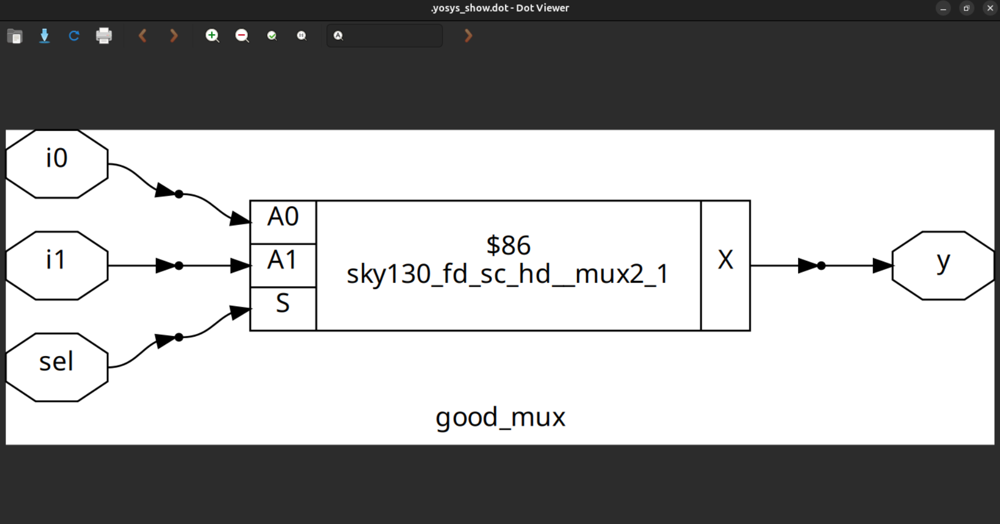
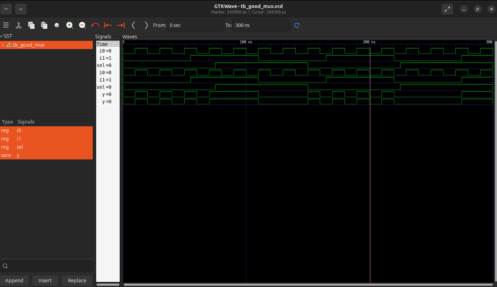

# Day 1: Foundations of RTL Design and Synthesis
Day 1 focuses on establishing the fundamentals of Register Transfer Level (RTL) design. The session introduces Verilog as a hardware description language, followed by functional verification using the open-source simulator Icarus Verilog. It also covers the basics of logic synthesis with Yosys, demonstrating how RTL code is mapped into gate-level representations. Through guided exercises, participants gain a clear understanding of the front-end digital design flow and build the foundation for advanced topics in subsequent sessions.

## Verilog Simulation with Icarus Verilog & GTKWave

### Objective
- Simulate a simple 2-to-1 multiplexer (MUX) using Verilog.
- Visualize the simulation waveform with GTKWave.

### Prerequisites
- Basic digital logic knowledge.
- Familiarity with Verilog syntax.

### Tools Required
- Icarus Verilog
- GTKWave

### Steps for Simulation

1. **Clone the Workshop Repository**
```bash
git clone https://github.com/kunalg123/sky130RTLDesignAndSynthesisWorkshop.git
cd sky130RTLDesignAndSynthesisWorkshop/verilog_files
```
2. **Installation of Tools**
```bash
sudo apt update
sudo apt install iverilog
sudo apt install gtkwave
```
3. **Verilog design for Multiplexer**
```bash
module good_mux (input i0, input i1, input sel, output reg y);
always @ (*)
begin
    if(sel)
        y <= i1;
    else 
        y <= i0;
end
endmodule
```
4. **Design Simulation**

Compile and simulate
```bash
iverilog good_mux.v tb_good_mux.v
```
Run the simulation
```bash
./a.out
```
View waveform
```bash
gtkwave tb_good_mux.vcd
```


### RTL Synthesis with Yosys & Gate Libraries

### Objective
-Synthesize the MUX design using Yosys.
-Map the design to the Sky130 standard cell library.

### Steps for Synthesis using Yosys

1. **Start Yosys**
```bash
yosys
```
2. **Read the Liberty File**
```bash
read_liberty -lib /address/to/your/sky130/file/sky130_fd_sc_hd__tt_025C_1v80.lib
```
3. **Read the Verilog Design**
```bash
read_verilog /home/vsduser/VLSI/sky130RTLDesignAndSynthesisWorkshop/verilog_files/good_mux.v
```
4. **Synthesize the design**
```bash
synth -top good_mux
```
5. **Technology mapping**
```bash
abc -liberty /address/to/your/sky130/file/sky130_fd_sc_hd__tt_025C_1v80.lib
```
6. **Visualize Netlist**
```bash
show
```

## Simulation result
  

##Insights

-Designed a 2-to-1 multiplexer in Verilog.
-Created a testbench to verify its functionality.
-Simulated the design using Icarus Verilog and viewed signals in GTKWave.
-Synthesized the design with Yosys.
-Mapped the design to Sky130 standard cells using ABC.
-Visualized the resulting gate-level netlist.
-Leveraged GTKWave to inspect signal behavior and Yosys to perform synthesis and technology mapping.
