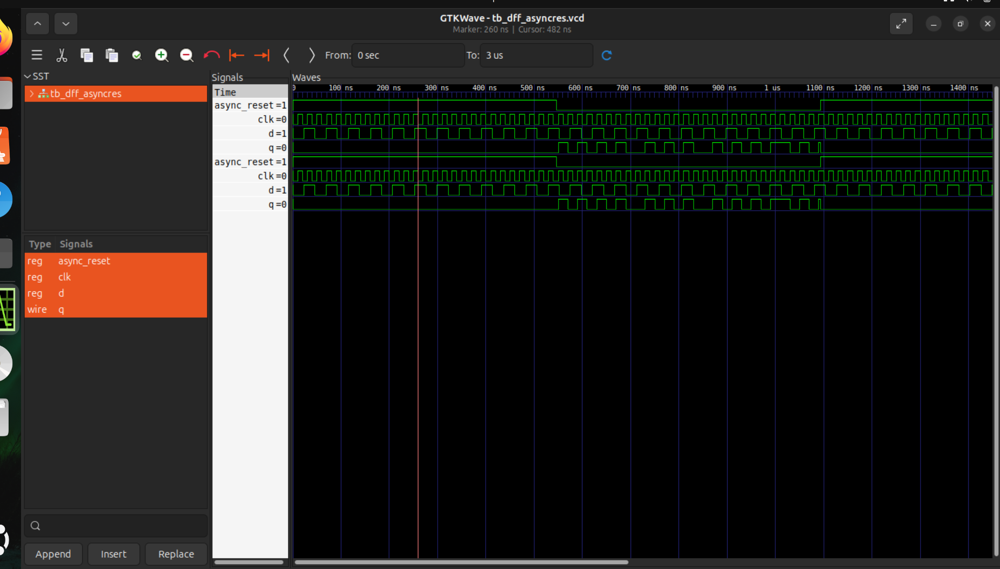
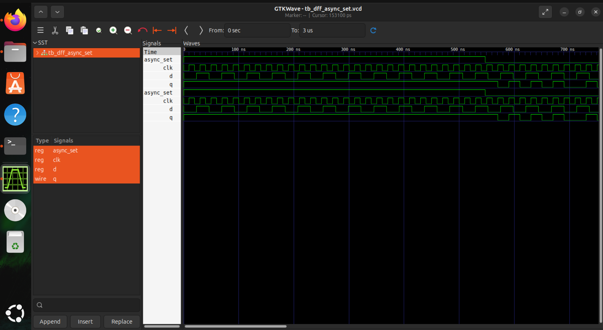
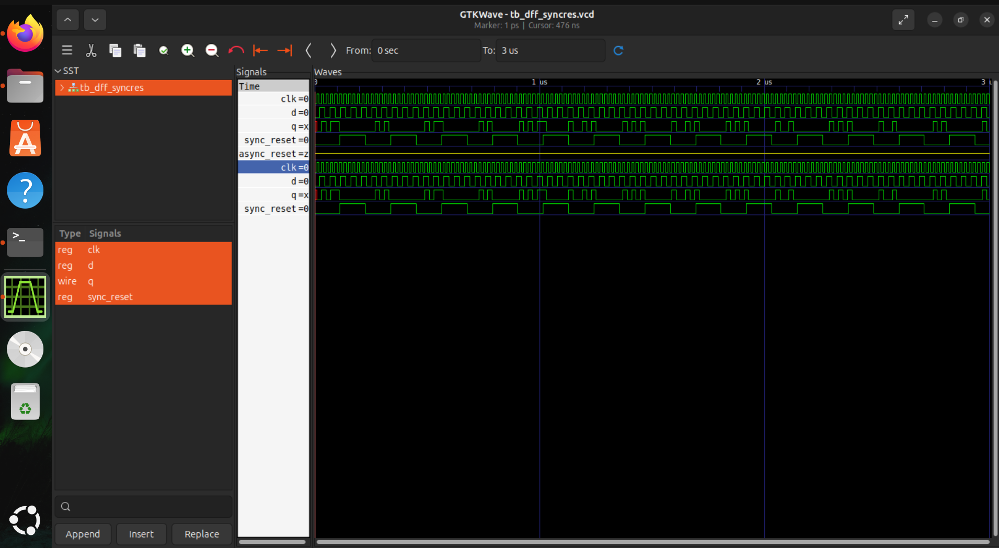
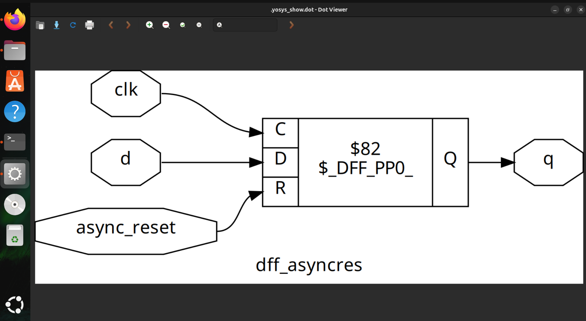
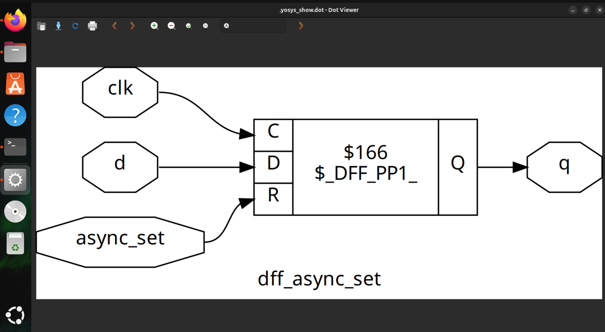
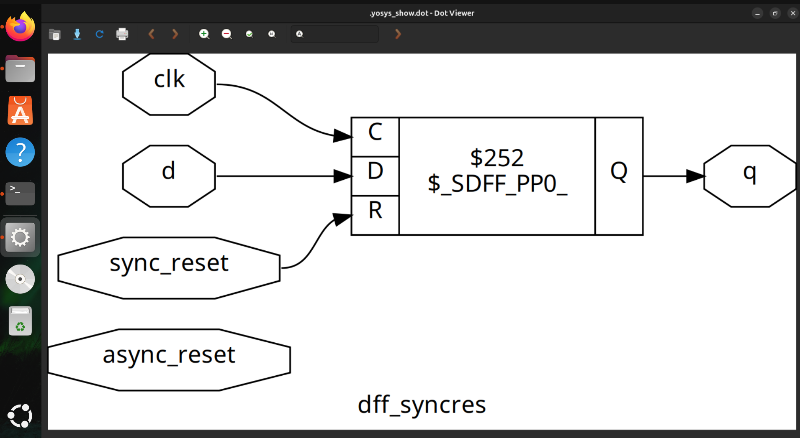

# Day 2 – Flip-Flop Coding, Simulation & Synthesis
This session focuses on understanding and implementing flip-flops, which are the fundamental sequential elements in digital design. The experiment involves:
Writing Verilog RTL code for different flip-flop coding styles (asynchronous reset, asynchronous set, synchronous reset).
Developing testbenches to verify functional correctness through simulation.
Running functional simulation using Icarus Verilog and waveform analysis with GTKWave.
Performing logic synthesis using Yosys with the Sky130 standard cell library, mapping RTL to real hardware cells.
By the end of this exercise, you will gain hands-on experience in:
Writing synthesizable Verilog code for sequential circuits.
Understanding the differences between asynchronous and synchronous control signals.
Using open-source EDA tools for simulation and waveform debugging.
Running synthesis flow to analyze gate-level implementations.

---

##  Objectives
- Implement different D flip-flop coding styles:
  - Asynchronous Reset
  - Asynchronous Set
  - Synchronous Reset
- Analyse **testbenches** for verification.
- Run **functional simulation** using:
  - [Icarus Verilog](http://iverilog.icarus.com/)
  - [GTKWave](http://gtkwave.sourceforge.net/)
- Perform **synthesis** using:
  - [Yosys](https://yosyshq.net/yosys/)
  - [Sky130 Standard Cell Library](https://skywater-pdk.readthedocs.io/)

---

## Example Verilog Codes

### Asynchronous Reset D Flip-Flop
```verilog
module dff_asyncres (input clk, input async_reset, input d, output reg q);
  always @ (posedge clk, posedge async_reset)
    if (async_reset)
      q <= 1'b0;
    else
      q <= d;
endmodule
```

### Asynchronous Set D Flip-Flop
```verilog
module dff_async_set (input clk, input async_set, input d, output reg q);
  always @ (posedge clk, posedge async_set)
    if (async_set)
      q <= 1'b1;
    else
      q <= d;
endmodule
```

### Asynchronous Set D Flip-Flop
```verilog
module dff_syncres (input clk, input async_reset, input sync_reset, input d, output reg q);
  always @ (posedge clk)
    if (sync_reset)
      q <= 1'b0;
    else
      q <= d;
endmodule
```

## Simulation Workflow

1. **Compile Design + Testbench**

```bash
iverilog dff_asyncres.v tb_dff_asyncres.v
```

2. **Run Simulation**

```bash
iverilog dff_asyncres.v tb_dff_asyncres.v
```

2. **View Output Waveform**

```bash
gtkwave tb_dff_asyncres.vcd
```
**Asynchronous Reset D Flip-Flop**

**Asynchronous Reset D Flip-Flop**

**Asynchronous Reset D Flip-Flop**


## Synthesis using Yosys

###Steps of simulation:

1. **Run Yosys**
```bash
yosys
```
2. **Inside Yosys Shell**
```bash
read_liberty -lib /address/to/your/sky130/file/sky130_fd_sc_hd__tt_025C_1v80.lib
read_verilog /path/to/dff_asyncres.v
synth -top dff_asyncres
abc -liberty ~/sky130RTLDesignAndSynthesisWorkshop/lib/sky130_fd_sc_hd__tt_025C_1v80.lib
show
```
- The same simulation and synthesis workflow (compilation, execution, waveform viewing, and Yosys mapping) is repeated for each of the flip-flop Verilog  codes. This ensures consistency in verifying functionality and observing behavior across different coding styles.

**Asynchronous Reset D Flip-Flop**

**Asynchronous Set D Flip-Flop**

**Synchronous Reset D Flip-Flop**


## Learning Outcomes

- Understood the distinction between asynchronous and synchronous control signals in flip-flops.
- Developed synthesizable Verilog code for sequential circuits.
- Performed functional verification using Icarus Verilog and GTKWave.
- Mapped RTL designs to Sky130 standard cells through Yosys synthesis.
