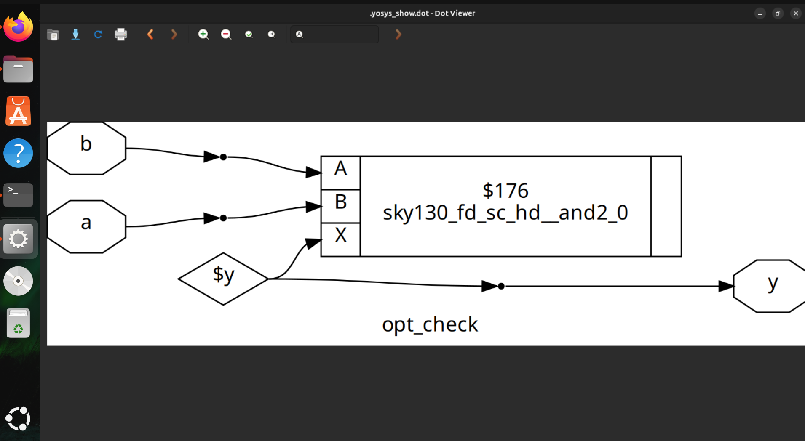
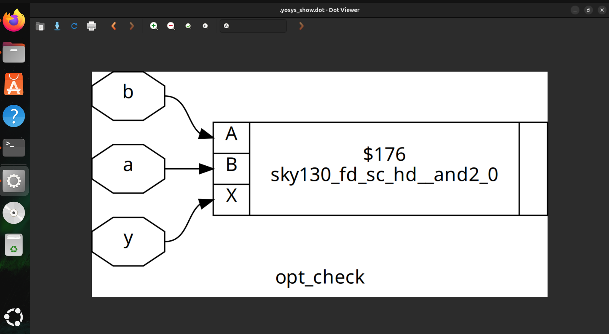
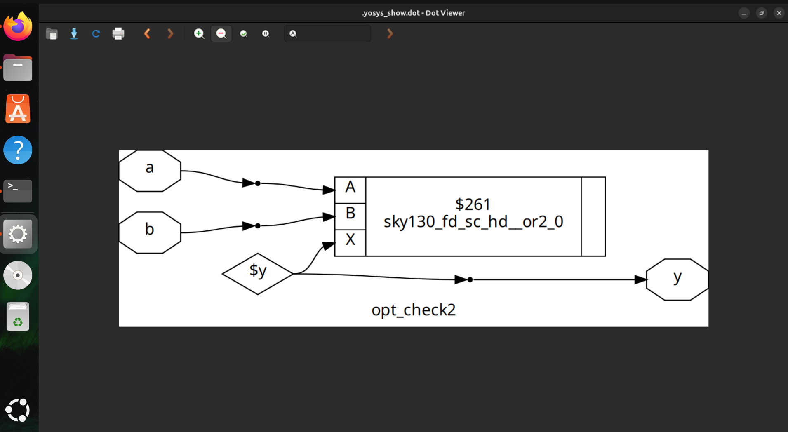
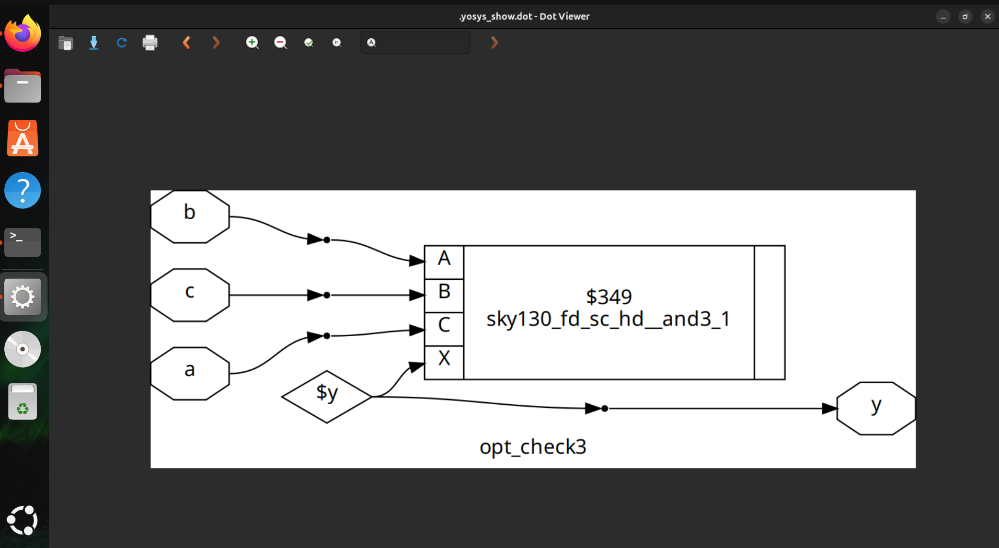

# Day 3: Combinational and Sequential Optimization

In this session, we explore techniques to enhance digital circuit performance and efficiency. Through practical labs, you will learn how to optimize combinational logic, refine sequential elements, and leverage synthesis tools to create faster, smaller, and more reliable designs.

### Lab 1: Constant Propagation Example

**Verilog Code:**
```verilog
module opt_check (input a, input b, output y);
    assign y = a ? b : 0;
endmodule
```
Explanation:

y = b if a = 1

y = 0 if a = 0

**Synthesis Command (Yosys)**

```bash
read_verilog lab1_opt.v
hierarchy -top opt_check
opt_clean -purge
abc -liberty your_lib_file.lib
write_verilog lab1_opt_synth.v
```

Dsign:



### Lab 2: 2-to-1 Multiplexer

Description: Implements a simple 2-to-1 multiplexer using conditional assignment.

**Verilog Code**

```bash
module opt_check2 (input a , input b , output y);
	assign y = a?1:b;
endmodule
```
Functional Behavior:

When a = 1, the output y is set to 1.
When a = 0, the output y follows the input b.

The module is optimized using constant propagation (opt_clean -purge in Yosys).
Acts as a combinational multiplexer with minimal logic depth.

Dsign:




### Lab 3: 2-to-1 Multiplexer

Description: Description: Same as Lab 2.

**Verilog Code**

```bash
module opt_check2 (input a , input b , output y);
	assign y = a?1:b;
endmodule
```
Functional Behavior:

2-to-1 multiplexer: y = a ? 1 : b.
when a is true, output is 1 , otherwise output is b

Dsign:



### Lab 4: Nested Conditional Logic

Description: Implements a three-input nested conditional logic using ternary operators.

**Verilog Code**

```bash
module opt_check3 (input a , input b, input c , output y);
        assign y = a?(c?b:0):0;
endmodule

```
Functional Behavior:

When a = 1 and c = 1, output y = b.
When a = 1 and c = 0, output y = 0.
When a = 0, output y = 0 regardless of b or c.

Dsign:




### : D Flip-Flop with Asynchronous Reset

Description: D flip-flop with asynchronous reset and constant load.

**Verilog Code**

```bash
module dff_const1(input clk, input reset, output reg q);
always @(posedge clk, posedge reset)
begin
        if(reset)
                q <= 1'b0;
        else
                q <= 1'b1;
end

endmodule

```
Functional Behavior:

When a = 1 and c = 1, output y = b.
When a = 1 and c = 0, output y = 0.
When a = 0, output y = 0 regardless of b or c.

Dsign:


### : Constant D Flip-Flop

Description: D flip-flop always outputting 1, regardless of reset or clock

**Verilog Code**

```bash
module dff_const2(input clk, input reset, output reg q);
always @(posedge clk, posedge reset)
begin
	if(reset)
		q <= 1'b1;
	else
		q <= 1'b1;
end
endmodule

```
Functional Behavior:

Output q is constantly 1.
Independent of clock or reset.

Dsign:


### Key Learnings 

Constant Propagation: Simplifies logic by replacing known values, reducing gates and circuit area.
Conditional Logic Optimization: Nested ternary operators can be efficiently minimized by synthesis tools.
Sequential Optimization: D flip-flops with constant assignments or resets can be optimized to reduce unnecessary registers.
Design Efficiency: Clean RTL + optimization commands (opt_clean -purge) yields faster, smaller, and low-power designs.
Verification: Testbenches ensure functional correctness before and after optimization.
Overall Insight: Efficient RTL coding combined with synthesis optimizations leads to smaller, faster, and more power-efficient circuits.
